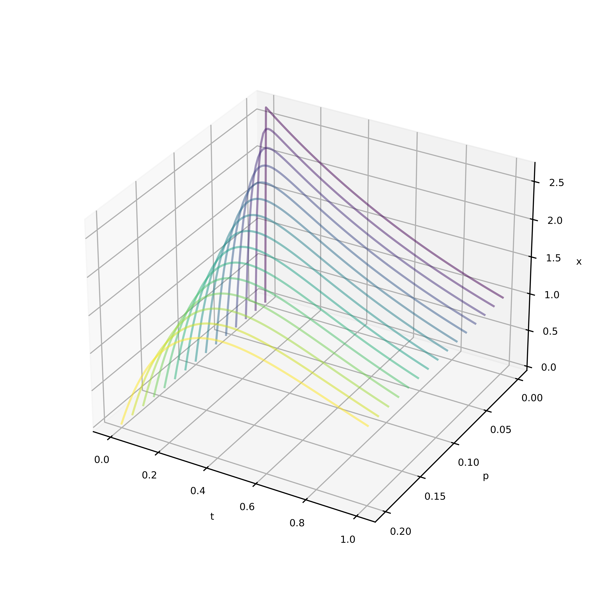

# Second-Order ODE System

$\epsilon y^{\prime \prime} + y^\prime + y = 0$, $0 \le x \le 1$  
$y(0)=a, y(1)=b$

The second order system described slowly evolves as the parameter $\epsilon$ changes.

## Setup

The system uses the `sekf` package. To install this within the currently-active python environment, run `pip install -e .` from the `Subset Extended Kalman Filter` directory.

## Usage

Within the `second-order ODE` directory, use the `config.json` file for user-provided arguments. These include:

- `RANDOM_SEED`: Seed used for random number generation
- `NOISE_STD`: Standard deviation of measurement noise

Training parameters:

- `TRAINING_EPSILON`: Initial $\epsilon$ value that NN is trained on
- `TRAINING_SAMPLES`: Number of training samples
- `TESTING_SAMPLES`: Number of testing samples
- `TRAINING_EPOCHS`: Number of training epochs
- `TRAINING_MODEL_SAVE_PATH`: Path to save the trained model
- `TRAINING_DATA_SAVE_PATH`: Path to save the training data
- `TRAINING_PLOT_PATH`: Path to save the training plot

Updating parameters:

- `UPDATING_FINAL_EPSILON`: Final $\epsilon$ value
- `UPDATING_N_MEASUREMENTS`: Number of measurements where `\epsilon` changes linearly from `TRAINING_EPSILON` to `UPDATING_FINAL_EPSILON`
- `UPDATING_MODEL_SAVE_PATH`: Path to save the updated model
- `UPDATING_PLANT_DATA_SAVE_PATH`: Path to save plant data
- `UPDATING_MODEL_DATA_SAVE_PATH`: Path to save the model predictions
- `UPDATING_OPTIMIZER_SAVE_PATH`: Path to save the updating optimizer
- `UPDATING_PARAM_SELECTION`: should itself be a JSON object with keys "method" and "param".
  - `method`: The method used to select the parameters. Options are "proportion", "magnitude", or "none".
  - `param`: The parameter used for the method. If "proportion" is selected, this should be a float between 0 and 1. If "magnitude" is selected, this should be a float greater than 0.

The secondOrderODE.py file contains many of the function definitions used in the training and updating process and may be used for running the process from start to finish. Otherwise:

1. Run `Python train_model.py` to train the model.
2. Run `Python update_model.py` to 1) take a measurement of the system and 2) update the model. Running this `UPDATING_N_MEASUREMENTS` times will update the model to the final epsilon value. The model is saved at `UPDATING_MODEL_SAVE_PATH` and the optimizer is saved at `UPDATING_OPTIMIZER_SAVE_PATH`. The updated model is then used to take measurements of the system.

Note that if the `train_model.py` and `update_model.py` files are run seperately, `secondOrderODE.py` should be modified so that the random number genrerator does not have a seed. If it does, it will always generate the same random walk step.

## TODO

- [ ] Initialize updating csv, optimizer, model
- [ ] Update step: plant and update model
- [ ] secondOrderODE.py: run all
